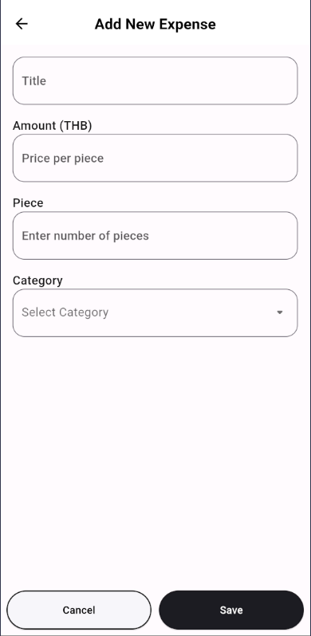

    

<h1 align="center">Split It!</h1>

Welcome to Split It! Our app is designed to simplify the process of tracking and splitting expenses among groups, making it ideal for outings, shared living expenses, or any scenario where group expenses are involved.

---

## 📊 Expense Tracking
- **Track Expenses:** Log expenses incurred by group members and see a comprehensive view of all group expenses.

## 💵 Bill Splitting
- **Fair Splitting:** Automatically calculate how much each group member owes based on the expenses they've shared.
- **Custom Splits(coming soon):** Adjust the split ratio per member for each expense, ensuring fairness based on actual usage or agreement.

## 👥 Group Management
- **Create Groups:** Set up groups for different events or shared interests.
- **Manage Members(coming soon):** Add or remove members as needed, from your contacts or by manually entering their details.

# Screenshots

<table>
  <tr>
    <th>Welcome Page</th>
    <th>Sign In Page</th>
    <th>Sign Up Page</th>
  </tr>
  <tr>
    <td></td>
    <td></td>
    <td></td>
  </tr>
</table>

<table>
  <tr>
    <th>Home Page</th>
    <th>New Group Page</th>
    <th>Select Contacts Page</th>
  </tr>
  <tr>
    <td></td>
    <td></td>
    <td></td>
  </tr>
</table>

<table>
  <tr>
    <th>Expenses Tab</th>
    <th>Bill Tab</th>
    <th>Totals Tab</th>
    <th>Info Tab</th>
  </tr>
  <tr>
    <td></td>
    <td></td>
    <td></td>
    <td></td>
  </tr>
</table>

<table>
  <tr>
    <th>PopUpMenu</th>
    <th>Delete Dialog</th>
    <th>Add Expenses Page</th>
  </tr>
  <tr>
    <td></td>
    <td></td>
    <td></td>
  </tr>
</table>

## Permissions Requested

To provide the best experience and functionality, our app requests the following permissions from you:

- **Camera Access**: Used for the [Capture Bill] feature to capture images of receipts directly.
- **Storage Access**: Required to access photos and other media files from the user’s device storage, which is necessary when users choose to manually upload images of bills or receipts.
- **Contacts Access**: Needed for adding participants from the user's contacts to groups.
