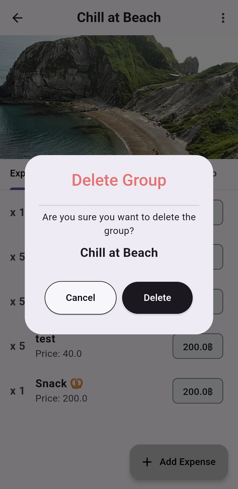

# Split It

Split IT App is an app that will be developed for expense management. In the case of expenses that are Creating an expense burden for more than one person and using expenses in each section unequally. Split IT will help manage the distribution of expenses in various items of each bill.

# 🔗 Download Split IT

  

# Screenshots

<table>
  <tr>
    <th>Welcome Page</th>
    <th>Sign In Page</th>
    <th>Sign Up Page</th>
  </tr>
  <tr>
    <td></td>
    <td></td>
    <td></td>
  </tr>
</table>

<table>
  <tr>
    <th>Home Page</th>
    <th>New Group Page</th>
    <th>Select Contacts Page</th>
  </tr>
  <tr>
    <td></td>
    <td></td>
    <td></td>
  </tr>
</table>

<table>
  <tr>
    <th>Expenses Tab</th>
    <th>Bill Tab</th>
    <th>Totals Tab</th>
    <th>Info Tab</th>
  </tr>
  <tr>
    <td></td>
    <td></td>
    <td></td>
    <td></td>
  </tr>
</table>

<table>
  <tr>
    <th>PopUpMenu</th>
    <th>Delete Dialog</th>
    <th>Add Expenses Page</th>
  </tr>
  <tr>
    <td></td>
    <td></td>
    <td></td>
  </tr>
</table>
